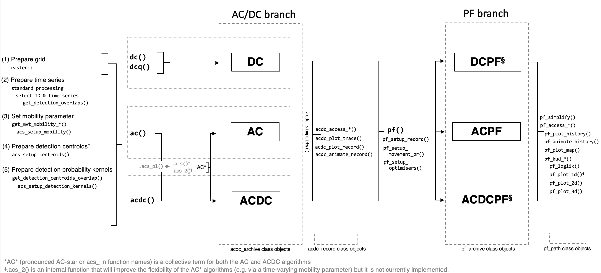

```{r, include = FALSE}
knitr::opts_chunk$set(
  collapse = TRUE,
  comment = "#>",
  fig.path = "man/figures/README-",
  out.width = "100%"
)
```

# flapper
**_From passive acoustic telemetry to space use: an `R` package of algorithms for reconstructing movement paths and patterns of space use from acoustic and archival time series._**

[](https://www.repostatus.org/#wip)

`flapper` is an `R` package which provides tools for passive acoustic telemetry (PAT) data. The package has been particularly motivated by the collection of new acoustic and archival data from a Critically Endangered elasmobranch, the flapper skate (_Dipturus intermedius_), off the west coast of Scotland where a static PAT array has been established to examine the movements of individuals within a Marine Protected Area. `flapper` has been designed to complement existing packages for the analyses of these data (e.g. [VTrack](https://github.com/RossDwyer/VTrack), [glatos](https://gitlab.oceantrack.org/GreatLakes/glatos) and [fishtrack3d](https://github.com/aspillaga/fishtrack3d) and [actel](https://github.com/hugomflavio/actel)), with a particular focus on the provision of tools that integrate PAT and archival data for improved inference of patterns of space use, including for pelagic and benthic/demersal species. To this end, `flapper` contains functions in the following themes:

* **Data processing tools**, including data assembly (e.g., range-testing datasets), the evaluation of false detections and quality checks;
* **Spatial tools**, including common spatial operations for the manipulation of spatial data, such as polygon inversion;
* **Distance calculations**, including the calculation of distances between receivers, along 3-dimensional movement paths, and of the shortest paths over a surface; 
* **Detection statistics**, including metrics of sampling effort, such as detection area; and individual detection metrics, such as detection days and co-occurrence; 
* **Space use algorithms**, including a straightforward implementation of the mean-position algorithm for the estimation of centres of activity and new algorithms designed for improved estimates of space use and the reconstruction of movement paths; 
* **Simulation tools**, including tools for the simulation of passive acoustic telemetry arrays, movement paths, detections and the comparison of simulated and inferred patterns of space use under different conditions;


_flapper: An `R` package designed to facilitate the integration of acoustic and archival datasets to improve estimates of space use. Inserted sample depth and acoustic time series were collected as part of the Movement Ecology of Flapper Skate project by Marine Scotland Science and NatureScot. The insert of the flapper skate is also courtesy of this project. The bathymetry data are sourced from the Ireland, Northern Island and Scotland Hydrographic survey (Howe et al., 2015). Plots were produced using the [prettyGraphics](https://github.com/edwardlavender/prettyGraphics) package._

## Highlights

The main highlights of the package are the provision of routines for the rapid calculation of biologically meaningful distances in area with complex barriers to movement (e.g., coastline) alongside algorithms (most of which are exclusive to `flapper`) for inferring space use from discrete detections at receivers, especially:

  * **`lcp_*()`.** These functions facilitate the calculation of shortest paths and their distances between and around points using efficient `C++` algorithms from the [cppRouting](https://github.com/vlarmet/cppRouting) package. This makes it easy to use biologically meaningful distances (that account for the bathymetric surface over which a benthic animal must move, if applicable, and barriers to movement) in movement models. 
  * **`coa()`.** This function implements the arithmetic version of the mean-position algorithm to estimate centres of activity (COAs) from discrete detections at receivers, given a detection matrix and the locations of receivers. 
  * **`ac()`.** The function implements the acoustic-centroid (AC) algorithm to examine patterns of space use. This is a new approach which utilises the information provided by acoustic detections in the form of acoustic centroids to infer where animals could have spent more or less time over the period of observations. Key innovations of this approach include the natural incorporation of barriers to movement (such as coastline), detection probability and information provided by the gaps between detections. 
  * **`dc()`.** This function implements the 'depth-contour' (DC) algorithm to examine patterns of space use. This relates one-dimensional depth time series to a two-dimensional bathymetry surface to determine the extent to which different parts of an area might have (or have not) been used, or effectively represent occupied depths, over time. 
  * **`acdc()`.** This function implements the 'acoustic-centroid depth-contour' (ACDC) algorithm to examine patterns of space use. This integrates the locational information provided by acoustic detections and concurrent depth observations to infer where tagged animals could have spent more or less time over the period of observations.
  * **`pf()`** is a particle filtering routine that refines time-specific maps of the possible locations of an animal (from `ac()`, `dc()` or `acdc()`) via a particle simulation and filtering process that permits the reconstruction of movement paths over landscape. 
  * **`sim_*()`.** These functions provide flexible, joined-up routines for the simulation of receiver arrays, movement paths and detections and can be used to evaluate alternative algorithms for inferences about patterns of space use under different conditions. 

## Installation

This package requires `R` version ≥ 4.0. You can check your current version with `R.version.string`. Subsequent installation steps (may) require the `devtools` and `pkgbuild` packages, which can be installed with `install.packages(c("devtools", "pkgbuild"))`. On Windows, package building requires `Rtools`. You can check whether `Rtools` is installed with `pkgbuild::has_rtools()`. If `Rtools` is not installed, it is necessary to download and install the appropriate version of `Rtools` before proceeding by following the instructions [here](https://cran.r-project.org/bin/windows/Rtools/). 

Three packages ([prettyGraphics](https://github.com/edwardlavender/prettyGraphics), [Tools4ETS](https://github.com/edwardlavender/Tools4ETS) and [glatos](https://gitlab.oceantrack.org/GreatLakes/glatos)) are required or suggested from [GitHub](https://github.com) repositories (since they are not currently available from [CRAN](https://cran.r-project.org)). These can be installed during the installation process (see below), but it is safer to install them sequentially as follows: 
```
devtools::install_github("edwardlavender/prettyGraphics") # required
devtools::install_github("edwardlavender/Tools4ETS")      # currently required
devtools::install_url(                                    # suggested
  "https://gitlab.oceantrack.org/GreatLakes/glatos/repository/master/archive.zip",
   build_opts = c("--no-resave-data", "--no-manual")) 
```

To install these packages with their vignettes, add `dependencies = TRUE` and `build_vignettes = TRUE` as arguments to the code above (see `?devtools::install_github` or `?devtools::install_url` for further information). Then, you can install the development version of `flapper` from [GitHub](https://github.com/edwardlavender/flapper) as shown below: 

``` r
devtools::install_github("edwardlavender/flapper", dependencies = TRUE, build_vignettes = TRUE)
```

The `dependencies = TRUE` argument will also install any suggested packages, which are required by some functions/examples and to build vignettes (which will be added to the package in due course). To access the vignettes, use `vignette("flapper_intro", package = "flapper")` for a general introduction to the package. _Note that vignettes have not yet been added to the package._ 

## Example datasets

A key feature of the `flapper` package is that almost all functions are designed to be implemented using standard object types (e.g., dataframes and matrices) rather than package-specific object classes. For simplicity, `flapper` makes some assumptions about variable names that follow a consistent and logical structure (e.g., individual IDs are given as `individual_id` and receiver IDs are given as `receiver_id`) but, notwithstanding this framework, this structure means that the functions in the package are accessible and straightforward to use. 

Functions are illustrated using simulated data and the following sample data collected from flapper skate off the west coast of Scotland:

* `dat_ids` is a dataset containing the characteristics of a sample of tagged flapper skate;
* `dat_moorings` is a dataset containing some sample passive acoustic telemetry receiver locations and associated information;
* `dat_acoustics` is a dataset containing some sample detection time series;
* `dat_archival` is a dataset containing some sample depth time series;
* `dat_sentinel` is a dataset containing some sample transmission--detection time series assembled from sentinel tags;

These example datasets were collected by Marine Scotland Science and NatureScot as part of the Movement Ecology of Flapper Skate project and belong to these organisations. If you wish to use these data, please contact Marine Scotland Science and NatureScot for further information. 

## Data processing tools 

A number of functions facilitate the acquisition, assembly, processing and checking of passive acoustic telemetry time series:

* **Data acquisition.** 
    * `query_*()` functions query online databases:
        * `query_open_topo()` queries the Topo Data Application Programming Interface for elevation/bathymetry data;
* **Data assembly.** 
    * `assemble_sentinel_counts()` assembles counts of transmissions/detections from sentinel tags for modelling purposes (i.e., to model detection probability);
    * `make_matrix_*()` functions create matrices of individual and receiver deployment time series and detection time series:
        * `make_matrix_ids()` matricises individual deployment time series;
        * `make_matrix_receivers()` matricises receiver deployment time series;
        * `make_matrix_detections()` matricises detection time series;
    * `make_df_*()` functions (i.e., `make_df_detections()`) reverse this process;
    
* **Data processing.**
    * `process_receiver_id()` adds unique receiver IDs to a dataframe (i.e., if the same receiver has been deployed more than once);
    * `process_false_detections_sf()` passes putative false detections through a spatial filter which incorporates information on receiver locations and animal swimming speeds to interrogate their plausibility;
    * `process_quality_check()` passes acoustic data through some basic quality checks prior to analysis; 
    * `process_surface()` determines an 'optimum' raster aggregation method and error induced by this process;

## Spatial tools 

A number of functions facilitate spatial operations that support ecological investigations and space use algorithms:

* `buffer_and_crop()` buffers a spatial object (e.g., receiver locations) and uses this buffered object to crop another (e.g., the local bathymetry); 
* `crop_from_click()` crops a raster to an area defined by mouse clicks;
* `cells_from_val()` returns the cells (or a raster of the cells) of a raster that are equal to a specified value or lie within a specified range of values;
* `invert_poly()` inverts a polygon (e.g, to define the 'sea' from a polygon of the 'land'); 
* `mask_io()` masks values in a raster that lie inside or outside of a spatial mask (e.g., to mask the 'land' from the 'sea');
* `sim_surface()` populates a raster with simulated values; 
* `split_raster_equally()` splits a raster into equal pieces (using code from the [greenbrown](http://greenbrown.r-forge.r-project.org) package);
* `update_extent()`shrinks or inflates an extent object;

## Distance calculations 

Some functions facilitate standard distance calculations using Euclidean distances:

* `dist_btw_clicks()` calculates distances and draws segments between sequential mouse clicks on a map; 
* `dist_btw_receivers()` calculates the Euclidean distances between all combinations of receivers;
* `dist_btw_points_3d()` calculates the Euclidean distances between points in three-dimensional space;
* `dist_over_surface()` calculates the total Euclidean distance along a path over a three-dimensional surface;

Often, Euclidean distances may not be a suitable representation of distance. This is especially the case for coastal benthic/demersal species in bathymetrically complex environments, for which navigation between locations may require movement over hilly terrain and around coastline. For this reason, a number of functions facilitate the calculation of shortest paths/distances:

* `lcp_costs()` calculates the distances between connected cells in a raster, accounting for planar (x, y, diagonal) and vertical (z) distances; 
* `lcp_graph_surface()` constructs connected graphs for least-cost paths analysis;
* `lcp_from_point()` calculates least-cost distances from a point on a raster to all of the other cells of a raster; 
* `lcp_over_surface()` calculates shortest path(s) and/or the distances of the shortest path(s) over a surface between origin and destination coordinates;
* `lcp_interp()` interpolates paths between sequential locations using least-cost paths analysis;

## Detection statistics

A number of functions facilitate the calculation of detection statistics, including those related to sampling effort and to detections of individuals:

* `get_detection_pr()` calculates detection probability given a model for detection probability with distance; 
* `get_detection_centroids()` defines detection centroids (areas within the maximum detection range) around receivers;
* `get_detection_centroids_overlap` identifies receivers with overlapping detection centroids in space and time;
* `get_detection_centroids_envir()` extracts environmental conditions from within receiver detection ranges, accounting for detection probability;
* `get_detection_area_sum()` calculates the total area surveyed by receivers; 
* `get_detection_area_ts()` defines a time series of the area surveyed by receivers; 
* `get_n_operational_ts()`defines a time series of the number of operational units (e.g., individuals at liberty or active receivers)
* `get_id_rec_overlap()` calculates the overlap between the deployment periods of tagged individuals and receivers;
* `get_detection_days()` calculates the total number of days during which each individual was detected (termed 'detection days');
* `get_detection_clump_lengths()` calculates detection 'clump' lengths;
* `get_detection_overlaps()` identifies 'overlapping' detections; 
* `get_residents()` identifies 'resident' individuals;
* `make_matrix_cooccurence()` computes a detection history similarity matrix across individuals;

## Movement metrics

Building on the analysis of detection time series, some functions (`get_mvt_*()`) provide movement metrics: 

* `get_mvt_mobility_*()` functions estimate swimming speeds: 
    * `get_mvt_mobility_from_acoustics()` estimates swimming speeds from acoustic detections; 
    * `get_mvt_mobility_from_archival()` estimates swimming speeds from archival time series;
* `get_mvt_resting()` identifies 'resting' behaviour from archival time series;
    
## Space use algorithms

The main thrust of `flapper` is the implementation of algorithms designed to infer space use from PAT data and their evaluation under different circumstances (e.g., array designs, movement models and detection models).

### The centres of activity (COA) algorithm 

Centres of activity (COA) are one of the most widely used metrics for the reconstruction of patterns of space use from PAT data. Several methods have been developed to calculate COAs, but the mean-position algorithm is the commonest. To generate estimates of space use, COAs are usually taken as point estimates from which utilisation distributions (typically kernel utilisation distributions, KUDs) are estimated. `flapper` facilitates the implementation of this approach with the following functions:

* `coa_setup_delta_t()` informs decisions as to an appropriate time interval over which to calculate COAs; 
* `make_matrix_detections()` summarises detections over time intervals (see above); 
* `coa()` implements the arithmetic version of the mean-position algorithm to calculate COAs; 
* `kud_around_coastline()` facilitates the estimation of home ranges (e.g., from estimated COAs) in areas of complex coastline;

### The `flapper` family of algorithms

Alongside the COA algorithm, this package introduces the `flapper` of algorithms for the inferring patterns of space use.


_The `flapper' family of algorithms. The acoustic-centroid depth-contour (ACDC) branch utilises acoustic and/or archival data to map the possible locations of an animal through time. The particle filtering (PF) branch refines these maps via the implementation of a particle simulation and filtering approach for the reconstruction of possible movement paths._

### AC/DC branch algorithms

#### The depth-contour (DC) algorithm

The depth-contour (DC) algorithm is the simplest. Whereas the COA approach only makes use of detections, the DC approach only uses depth observations. Specifically, this algorithm uses observed depths (± some error) to define the subset of possible locations of each individual within a defined area: for pelagic species, tagged individuals must be in an area where the depth is at least as deep as the observed depth; for benthic/demersal species, tagged individuals must be in an area close in depth to the observed depth. This is implemented via `dc()`. The 'quick' depth-contour (DCQ) algorithm, implemented via `dcq()`, uses a modified version of this algorithm for quicker run times. 

#### The acoustic-contour* (AC*) algorithm(s)

The `flapper` family-equivalent of the COA algorithm is the acoustic-contour (AC) algorithm. This approach represents the information from acoustic detections in the form of acoustic centroids, which contract and expand in line with the distribution of uncertainty in the individual's location when it is detected and in the gaps between detections. The acoustic-centroid depth-contour (ACDC) algorithm combines the AC and DC algorithms, using PAT data to inform the area within which depth contours are most likely to be found. These algorithms are implemented with the `acdc*()` family of functions: 

* `acs_setup_mobility()` examines the assumption of a constant 'mobility' parameter; 
* `acs_setup_n_centroids()` suggests the number of acoustic centroids for the algorithm(s); 
* `acs_setup_centroids()` defines the acoustic centroids for the algorithm(s);
* `acs_setup_detection_kernels()` defines detection probability kernels for the algorithm(s);
* `ac()` and `acdc()` implement the algorithm(s), via the back-end functions `.acs_pl()` and `.acs()`;

#### AC/DC post-processing and analysis

The AC/DC branch functions (`ac()`, `dc()` and `acdc()`) all return objects of class `acdc_archive`. These can be processed and analysed using several key functions: 

* `acdc_simplify()` simplifies `acdc_archive-class` objects into `acdc_record-class` objects; 
* `acdc_access_*()` functions provide short-cuts to different elements of `acdc_record-class` objects:
    * `acdc_access_dat()` accesses stored dataframes; 
    * `acdc_access_timesteps()` accesses the total number of time steps;
    * `acdc_access_maps()` accesses stored maps; 
* `acdc_plot_record()` plots the results of the algorithm(s); 
* `acdc_animate_record()` creates html animations of algorithm(s); 

### Particle filtering branch algorithms 

Each algorithm (AC, DC and ACDC) can be extended through incorporation of a movement model to reconstruct movement paths over a surface that are consistent with the observations (and model assumptions). The resultant algorithms are termed the ACPF, DCPF and ACDCPF algorithms. The approach is implemented via a particle simulation and filtering process provided by the `pf*()` family of functions: 

* `pf_setup_movement_pr` provides a simple movement model that defines the probability of movement between locations given the distance between them; 
* `pf_setup_record()` creates an ordered list of input files;
* `pf()` implements the particle filtering routine; 
* `pf_plot_history()` plot simulated particle histories; 
* `pf_animate_history()` animates simulated particle histories;
* `pf_plot_map()` maps the 'probability of use' across an area based on sampled particles;
* `pf_simplify()` assembles movement paths from particle histories;
* `pf_loglik()` calculates the log-likelihood of reconstructed paths, given the movement model;
* `pf_plot_1d()` plots the depth time series from observed and reconstructed paths;
* `pf_plot_2d()` maps the reconstructed paths in two-dimensions;
* `pf_plot_3d()` maps the reconstructed paths in three-dimensions; 

## Simulation tools 

Simulations are a valuable tool in ecology which can elucidate the relative performance of alternative methods for ecological inferences (e.g., the `COA` approach versus the `DC` approach for inferring patterns of space use) and the extent to which new data sources influence ecological inferences under different circumstances (e.g. the extent to which sparse or regular PAT detections improve estimates of space use). To this end, `flapper` provides joined-up routines for the evaluation of approaches for the estimation of patterns of space use under different conditions; namely:

* `sim_array()` simulates alternative array designs;  
* `sim_path_*()` functions simulate discrete-time movement paths, including: 
    * `sim_path_sa()`, supported by `sim_steps()` and `sim_angles()`, simulates movement paths (possibly in restricted areas) from step lengths and turning angles; 
    * `sim_path_ou_1()` simulates movement paths under Ornstein-Uhlenbeck processes; 
* `sim_detections()` simulates detections at receivers arising from movement paths under a diversity of detection probability models;

To evaluate the performance of alternative algorithms for inferring patterns of space use under different array designs, movement models and detections models, `eval_by_kud()` compares patterns of space use inferred from simulated and estimated movement paths using kernel utilisation distributions. 

## Associated packages

* **[prettyGraphics](https://github.com/edwardlavender/prettyGraphics)** facilitates the production of pretty, publication-quality and interactive visualisations, with a particular focus on time series. This makes it easy to create abacus plots, visualise time series (across factor levels, at different temporal scales and in relation to covariates), bathymetric landscapes and movement pathways in three-dimensions, and detection similarity matrices. 
* **[Tools4ETS](https://github.com/edwardlavender/Tools4ETS)** provides a set of general tools for ecological time series, including for the definition of time categories, matching time series (e.g., detection observations with temporally varying environmental covariates), flagging independent time series and simulations. 
* **[fvcom.tbx](https://github.com/edwardlavender/fvcom.tbx)** provides tools for the integration of hydrodynamic model predictions (from the Finite Volume Coastal Ocean Model) with ecological datasets (e.g., detection time series). This facilitates the inclusion of hydrodynamic model predictions as covariates in movement models and the validation of hydrodynamic model predictions with movement datasets or data collected from static acoustic receivers. This package was particularly motivated by the West Scotland Coastal Ocean Modelling System (WeStCOMS). 

## References 

Howe, J.A., Anderton, R., Arosio, R., Dove, D., Bradwell, T., Crump, P., Cooper, R., Cocuccio, A., 2014. The seabed geomorphology and geological structure of the Firth of Lorn, western Scotland, UK, as revealed by multibeam echo-sounder survey. Earth Environ. Sci. Trans. R. Soc. Edinburgh 105, 273–284. https://doi.org/10.1017/S1755691015000146
