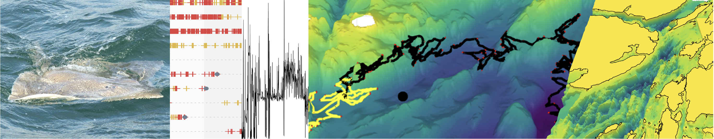
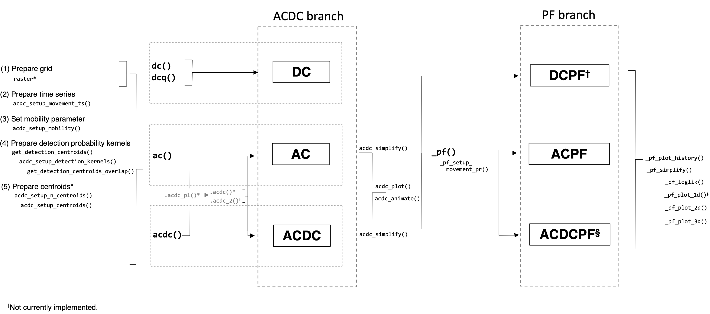

# flapper

**Routines for the analysis of passive acoustic telemetry data,
including the reconstruction of fine-scale movement paths and emergent
patterns of space use. <https://edwardlavender.github.io/flapper/>**

[](https://www.repostatus.org/#active)
[](https://lifecycle.r-lib.org/articles/stages.html#experimental)
[](https://CRAN.R-project.org/package=flapper)

[`flapper`](https://edwardlavender.github.io/flapper/) is an `R` package
which provides tools for passive acoustic telemetry data. The package
has been particularly motivated by the collection of acoustic and
archival data from a Critically Endangered elasmobranch, the flapper
skate (*Dipturus intermedius*), off the west coast of Scotland where a
static passive acoustic telemetry array was established to examine the
movements of individuals within a Marine Protected Area.
[`flapper`](https://edwardlavender.github.io/flapper/) has been designed
to complement existing packages for the analysis of these data
(e.g. [VTrack](https://github.com/RossDwyer/VTrack),
[glatos](https://github.com/ocean-tracking-network/glatos) and
[fishtrack3d](https://github.com/aspillaga/fishtrack3d) and
[actel](https://github.com/hugomflavio/actel)), with a particular focus
on the provision of movement modelling methods for passive acoustic
telemetry systems that permit the reconstruction of fine-scale movement
paths and emergent patterns of space use. To this end,
[`flapper`](https://edwardlavender.github.io/flapper/) contains
functions in the following themes:

- **Data processing tools**, including data assembly (e.g.,
  range-testing datasets), the evaluation of false detections and
  quality checks;
- **Spatial tools**, including common spatial operations for the
  manipulation of spatial data, such as polygon inversion;
- **Distance calculations**, including the calculation of distances
  between receivers, along 3-dimensional movement paths, and of the
  shortest paths over a surface;
- **Detection statistics**, including metrics of sampling effort, such
  as detection area; and individual detection metrics, such as detection
  days and co-occurrence;
- **Modelling methods**, including a straightforward implementation of
  the mean-position algorithm for the estimation of centres of activity
  and new algorithms designed for improved estimates of space use and
  the reconstruction of movement paths;
- **Simulation tools**, including tools for the simulation of passive
  acoustic telemetry arrays, movement paths, detections and the
  comparison of simulated and reconstructed patterns of space use under
  different conditions;

 *flapper: An `R` package of
routines for the analysis of passive acoustic telemetry data, especially
the reconstruction of fine-scale movement paths and emergent patterns of
space use. Inserted sample depth and acoustic time series were collected
as part of the Movement Ecology of Flapper Skate project by Marine
Scotland Science and NatureScot. The insert of the flapper skate is also
courtesy of this project. The bathymetry data are sourced from the
Ireland, Northern Island and Scotland Hydrographic survey (Howe et al.,
2014. Earth Environ. Sci. Trans. R. Soc. Edinburgh 105, 273–284.). Plots
were produced using the
[prettyGraphics](https://github.com/edwardlavender/prettyGraphics)
package.*

**For full package details, vignettes and illustrated examples, go to
<https://edwardlavender.github.io/flapper/>.**

## Highlights

The main highlights of the package are the provision of routines for the
rapid calculation of biologically meaningful distances in areas with
complex barriers to movement (e.g., coastline) alongside algorithms
(most of which are exclusive to
[`flapper`](https://edwardlavender.github.io/flapper/)) for
reconstructing movements and patterns of space use from discrete
detections at receivers, especially:

- **`lcp_*()`.** These functions facilitate the calculation of shortest
  paths and their distances between and around points using efficient
  `C++` algorithms from the
  [`cppRouting`](https://github.com/vlarmet/cppRouting) package. This
  makes it easy to use biologically meaningful distances (that account
  for the bathymetric surface over which a benthic animal must move, if
  applicable, and barriers to movement) in movement models.
- **`coa()`.** This function implements the arithmetic version of the
  mean-position algorithm to estimate centres of activity (COAs) from
  discrete detections at receivers, given a detection matrix and the
  locations of receivers.
- **`ac()`.** The function implements the acoustic-container (AC)
  algorithm. This is a new approach which utilises the information
  provided by acoustic detections in the form of acoustic containers to
  reconstruct the expected time spent in different parts of a study area
  over the period of observations. Key innovations of this approach
  include the natural incorporation of barriers to movement (such as
  coastline), detection probability and information provided by the gaps
  between detections.
- **`dc()`.** This function implements the ‘depth-contour’ (DC)
  algorithm. This relates one-dimensional depth time series to a
  two-dimensional bathymetry surface to determine the extent to which
  different parts of an area might have (or have not) been used, or
  effectively represent occupied depths, over time.
- **`acdc()`.** This function implements the ‘acoustic-container
  depth-contour’ (ACDC) algorithm. This integrates the locational
  information provided by acoustic detections and concurrent depth
  observations to refine expectations of the time spent in different
  parts of a study area over the period of observations.
- **`pf()`** is a particle filtering routine that refines time-specific
  maps of the possible locations of an animal (from `ac()`, `dc()` or
  `acdc()`) via a particle simulation and filtering process that permits
  the reconstruction of movement paths over landscape.
- **`sim_*()`.** These functions provide flexible, joined-up routines
  for the simulation of receiver arrays, movement paths and detections.

## Installation

This package requires `R` version ≥ 4.0. You can check your current
version with `R.version.string`. Subsequent installation steps (may)
require the `devtools` and `pkgbuild` packages, which can be installed
with `install.packages(c("devtools", "pkgbuild"))`. On Windows, package
building requires `Rtools`. You can check whether `Rtools` is installed
with `pkgbuild::has_rtools()`. If `Rtools` is not installed, it is
necessary to download and install the appropriate version of `Rtools`
before proceeding by following the instructions
[here](https://cran.r-project.org/bin/windows/Rtools/).

Four packages
([prettyGraphics](https://github.com/edwardlavender/prettyGraphics),
[Tools4ETS](https://github.com/edwardlavender/Tools4ETS),
[fasterRaster](https://github.com/adamlilith/fasterRaster) and
[glatos](https://github.com/ocean-tracking-network/glatos)) are required
or suggested from [GitHub](https://github.com) repositories (since they
are not currently available from [CRAN](https://cran.r-project.org)).
These can be installed during the installation process (see below), but
it is safer to install them sequentially as follows:

    devtools::install_github("edwardlavender/prettyGraphics") # required
    devtools::install_github("edwardlavender/Tools4ETS")      # required
    devtools::install_github("adamlilith/fasterRaster")       # suggested
    devtools::install_github("ocean-tracking-network/glatos") # suggested

To install these packages with their vignettes, add
`dependencies = TRUE` and `build_vignettes = TRUE` as arguments to the
code above (see `?devtools::install_github` or `?devtools::install_url`
for further information). Then, you can install the development version
of [`flapper`](https://edwardlavender.github.io/flapper/) from
[GitHub](https://github.com/edwardlavender/flapper) as shown below:

``` r
devtools::install_github("edwardlavender/flapper", dependencies = TRUE, build_vignettes = TRUE)
```

The `dependencies = TRUE` argument will also install any suggested
packages, which are required by some functions/examples and to build
vignettes (which will be added to the package in due course). To access
the vignettes, use `vignette("flapper_intro", package = "flapper")` for
a general introduction to the package. *Note that vignettes have not yet
been added to the package.*

## Example datasets

A key feature of the
[`flapper`](https://edwardlavender.github.io/flapper/) package is that
most functions are designed to be implemented using standard object
types (e.g., dataframes and matrices) rather than package-specific
object classes. For simplicity,
[`flapper`](https://edwardlavender.github.io/flapper/) makes some
assumptions about variable names that follow a consistent and logical
structure (e.g., individual IDs are given as `individual_id` and
receiver IDs are given as `receiver_id`) but, notwithstanding this
framework, this structure means that the functions in the package are
accessible and straightforward to use.

Functions are illustrated using simulated data and the following sample
data collected from flapper skate off the west coast of Scotland:

- `dat_ids` is a dataset containing the characteristics of a sample of
  tagged flapper skate;
- `dat_moorings` is a dataset containing some sample passive acoustic
  telemetry receiver locations and associated information;
- `dat_acoustics` is a dataset containing some sample detection time
  series;
- `dat_archival` is a dataset containing some sample depth time series;
- `dat_sentinel` is a dataset containing some sample
  transmission–detection time series assembled from sentinel tags;

These example datasets were collected by Marine Scotland Science and
NatureScot as part of the Movement Ecology of Flapper Skate project and
belong to these organisations. If you wish to use these data, please
contact Marine Scotland Science and NatureScot for further information.

## Data processing tools

A number of functions facilitate the acquisition, assembly, processing
and checking of passive acoustic telemetry time series:

- **Data acquisition.**
  - `query_*()` functions query online databases:
    - `query_open_topo()` queries the Topo Data Application Programming
      Interface for elevation/bathymetry data;
- **Data assembly.**
  - `assemble_sentinel_counts()` assembles counts of
    transmissions/detections from sentinel tags for modelling purposes
    (i.e., to model detection probability);
  - `make_matrix_*()` functions create matrices of individual and
    receiver deployment time series and detection time series:
    - `make_matrix_ids()` matricises individual deployment time series;
    - `make_matrix_receivers()` matricises receiver deployment time
      series;
    - `make_matrix_detections()` matricises detection time series;
  - `make_df_*()` functions (i.e., `make_df_detections()`) reverse this
    process;
- **Data processing.**
  - `process_receiver_id()` adds unique receiver IDs to a dataframe
    (i.e., if the same receiver has been deployed more than once);
  - `process_false_detections_sf()` passes putative false detections
    through a spatial filter which incorporates information on receiver
    locations and animal swimming speeds to interrogate their
    plausibility;
  - `process_quality_check()` passes acoustic data through some basic
    quality checks prior to analysis;
  - `process_surface()` determines an ‘optimum’ raster aggregation
    method and error induced by this process;

## Spatial tools

A number of functions facilitate spatial operations that support common
tasks and modelling algorithms:

- `buffer_and_crop()` buffers a spatial object (e.g., receiver
  locations) and uses this buffered object to crop another (e.g., the
  local bathymetry);
- `get_intersection()` intersects spatial geometries;
- `xy_from_click()` gets location coordinates from mouse clicks;
- `crop_from_click()` crops a raster to an area defined by mouse clicks;
- `cells_from_val()` returns the cells (or a raster of the cells) of a
  raster that are equal to a specified value or lie within a specified
  range of values;
- `invert_poly()` inverts a polygon (e.g, to define the ‘sea’ from a
  polygon of the ‘land’);
- `mask_io()` masks values in a raster that lie inside or outside of a
  spatial mask (e.g., to mask the ‘land’ from the ‘sea’);
- `sim_surface()` populates a raster with simulated values;
- `split_raster_equally()` splits a raster into equal pieces (using code
  from the [greenbrown](http://greenbrown.r-forge.r-project.org)
  package);
- `update_extent()`shrinks or inflates an extent object;
- `segments_cross_barrier()` determines if Euclidean transects cross a
  barrier;

## Distance calculations

Some functions facilitate standard distance calculations using Euclidean
distances:

- `dist_btw_clicks()` calculates distances and draws segments between
  sequential mouse clicks on a map;
- `dist_btw_receivers()` calculates the Euclidean distances between all
  combinations of receivers;
- `dist_btw_points_3d()` calculates the Euclidean distances between
  points in three-dimensional space;
- `dist_over_surface()` calculates the total Euclidean distance along a
  path over a three-dimensional surface;

Often, Euclidean distances may not be a suitable representation of
distance. This is especially the case for coastal benthic/demersal
species in bathymetrically complex environments, for which navigation
between locations may require movement over hilly terrain and around
coastline. For this reason, a number of functions facilitate the
calculation of shortest paths/distances:

- `lcp_costs()` calculates the distances between connected cells in a
  raster, accounting for planar (x, y, diagonal) and vertical (z)
  distances;
- `lcp_graph_surface()` constructs connected graphs for least-cost paths
  analysis;
- `lcp_from_point()` calculates least-cost distances from a point on a
  raster to all of the other cells of a raster;
- `lcp_over_surface()` calculates shortest path(s) and/or the distances
  of the shortest path(s) over a surface between origin and destination
  coordinates;
- `lcp_interp()` interpolates paths between sequential locations using
  least-cost paths analysis;
- `lcp_comp()` compares Euclidean and shortest-distance metrics for an
  area;

## Detection statistics

A number of functions facilitate the calculation of detection
statistics, including those related to sampling effort and to detections
of individuals:

- `get_detection_pr()` calculates detection probability given a model
  for detection probability with distance;
- `get_detection_containers()` defines detection containers (areas
  within the maximum detection range) around receivers;
- `get_detection_containers_overlap()` identifies receivers with
  overlapping detection containers in space and time;
- `get_detection_containers_envir()` extracts environmental conditions
  from within receiver detection ranges, accounting for detection
  probability;
- `get_detection_area_sum()` calculates the total area surveyed by
  receivers;
- `get_detection_area_ts()` defines a time series of the area surveyed
  by receivers;
- `get_n_operational_ts()`defines a time series of the number of
  operational units (e.g., individuals at liberty or active receivers)
- `get_id_rec_overlap()` calculates the overlap between the deployment
  periods of tagged individuals and receivers;
- `get_detection_days()` calculates the total number of days during
  which each individual was detected (termed ‘detection days’);
- `get_detection_clumps()` identifies detection ‘clumps’ and calculates
  their lengths;
- `get_detection_overlaps()` identifies ‘overlapping’ detections;
- `get_residents()` identifies ‘resident’ individuals;
- `make_matrix_cooccurence()` computes a detection history similarity
  matrix across individuals;

## Movement metrics

Building on the analysis of detection time series, some functions
(`get_mvt_*()`) provide movement metrics:

- `get_mvt_mobility_*()` functions estimate swimming speeds:
  - `get_mvt_mobility_from_acoustics()` estimates swimming speeds from
    acoustic detections;
  - `get_mvt_mobility_from_archival()` estimates swimming speeds from
    archival time series;
- `get_mvt_resting()` identifies ‘resting’ behaviour from archival time
  series;
- `get_hr_*()` functions get animal ‘home ranges’:
  - `get_hr_prop()` gets a custom range from a utilisation distribution
    (UD);
  - `get_hr_core()` gets the ‘core range’ from a UD;
  - `get_hr_home()` gets the ‘home range’ from a UD;
  - `get_hr_full()` gets the ‘full range’ from a UD;

## Modelling algorithms

The main thrust of
[`flapper`](https://edwardlavender.github.io/flapper/) is the
implementation of algorithms designed to reconstruct fine-scale movement
paths and emergent patterns of space use in passive acoustic telemetry
systems.

### The centres of activity (COA) algorithm

Centres of activity (COA) are one of the most widely used metrics for
the reconstruction of patterns of space use from passive acoustic
telemetry data. Several methods have been developed to calculate COAs,
but the mean-position algorithm is the commonest. To generate estimates
of space use, COAs are usually taken as point estimates from which UDs
(typically kernel UDs or KUDs) are estimated.
[`flapper`](https://edwardlavender.github.io/flapper/) facilitates the
implementation of this approach with the following functions:

- `coa_setup_delta_t()` informs decisions as to an appropriate time
  interval over which to calculate COAs;
- `make_matrix_detections()` summarises detections over time intervals
  (see above);
- `coa()` implements the arithmetic version of the mean-position
  algorithm to calculate COAs;
- `kud_habitat()`, `kud_around_coastline()` and
  `kud_around_coastline_fast()` facilitate the estimation of home ranges
  (e.g., from estimated COAs) in areas of complex coastline;

### The [`flapper`](https://edwardlavender.github.io/flapper/) family of algorithms

Alongside the COA algorithm, this package introduces the
[`flapper`](https://edwardlavender.github.io/flapper/) of algorithms for
the inferring patterns of space use.

 *The
‘flapper’ family of algorithms. The acoustic-container (AC) branch
utilises acoustic data (and/or ancillary information) to reconstruct the
set of possible locations for an individual through time. The particle
filtering (PF) branch refines this set via the implementation of a
particle simulation and filtering approach for the reconstruction of
possible movement paths.*

### AC/DC branch algorithms

#### The depth-contour (DC) algorithm

The depth-contour (DC) algorithm is the simplest. Whereas the COA
approach only makes use of detections, the DC approach only uses depth
observations. Specifically, this algorithm uses observed depths (± some
error) to define the subset of possible locations of each individual
within a defined area: for pelagic species, tagged individuals must be
in an area where the seabed depth is at least as deep as the observed
depth; for benthic/demersal species, tagged individuals must be in an
area where the seabed depth is close to the observed depth. This is
implemented via `dc()`. The ‘quick’ depth-contour (DCQ) algorithm,
implemented via `dcq()`, uses a modified version of this algorithm for
quicker run times.

#### The acoustic-container\* (AC\*) algorithm(s)

The [`flapper`](https://edwardlavender.github.io/flapper/)
family-equivalent of the COA algorithm is the acoustic-container (AC)
algorithm. This approach represents the information from acoustic
detections in the form of acoustic containers, which contract and expand
in line with our uncertainty in an individual’s location when it is
detected and in the gaps between detections. The acoustic-container
depth-contour (ACDC) algorithm combines the AC and DC algorithms, using
passive acoustic telemetry data to inform the area within which depth
contours are most likely to be found. These algorithms are implemented
with the `ac*()` family of functions:

- `acs_setup_mobility()` examines the assumption of a constant
  ‘mobility’ parameter;
- `acs_setup_containers()` defines the detection containers for the
  algorithm(s);
- `acs_setup_detection_kernels()` defines detection probability kernels
  for the algorithm(s);
- `ac()` and `acdc()` implement the algorithm(s), via the back-end
  functions `.acs_pl()` and `.acs()`;

#### AC/DC post-processing and analysis

The AC-branch functions (`ac()`, `dc()` and `acdc()`) all return objects
of class `acdc_archive`. These can be processed and analysed using
several key functions:

- `acdc_simplify()` simplifies `acdc_archive-class` objects into
  `acdc_record-class` objects;
- `acdc_access_*()` functions provide short-cuts to different elements
  of `acdc_record-class` objects:
  - `acdc_access_dat()` accesses stored dataframes;
  - `acdc_access_timesteps()` accesses the total number of time steps;
  - `acdc_access_maps()` accesses stored maps;
- `acdc_plot_trace()` plots acoustic container dynamics;
- `acdc_plot_record()` plots the results of the algorithm(s);
- `acdc_animate_record()` creates html animations of algorithm(s);

### Particle filtering branch algorithms

Each algorithm (AC, DC and ACDC) can be extended through incorporation
of a movement model to reconstruct movement paths over a surface that
are consistent with the observations (and model assumptions). The
resultant algorithms are termed the ACPF, DCPF and ACDCPF algorithms.
The approach is implemented via a particle simulation and filtering
process provided by the `pf*()` family of functions:

- `pf_setup_movement_pr` provides a simple movement model that defines
  the probability of movement between locations given the distance
  between them;
- `pf_setup_record()` creates an ordered list of input files;
- `pf_setup_optimisers()` controls optimisation settings;
- `pf()` implements the particle filtering routine;
- `pf_access_history_files()` lists particle histories saved to file;
- `pf_access_history()` accesses particle histories;
- `pf_access_particles_unique()` accesses unique particle samples;
- `pf_plot_history()` plots particle histories;
- `pf_animate_history()` animates particle histories;
- `pf_simplify()` processes particle histories and assembles movement
  paths;
- `pf_plot_map()` maps the expected ‘proportion-of-use’ (POU) across an
  area based on sampled particles or reconstructed paths;
- `pf_kud()` smooths POU maps using kernel smoothing;
- `pf_kud_1()` and `pf_kud_2()` apply kernel smoothing to sampled
  particles or reconstructed paths;
- `pf_loglik()` calculates the log-probability of reconstructed paths,
  given the movement model;
- `pf_plot_1d()` plots the depth time series from observed and
  reconstructed paths;
- `pf_plot_2d()` maps the reconstructed paths in two-dimensions;
- `pf_plot_3d()` maps the reconstructed paths in three-dimensions;

## Simulation tools

[`flapper`](https://edwardlavender.github.io/flapper/) provides
joined-up routines for the simulation of acoustic arrays, movement paths
and detections at receivers:

- `sim_array()` simulates alternative array designs;  
- `sim_path_*()` functions simulate discrete-time movement paths,
  including:
  - `sim_path_sa()`, supported by `sim_steps()` and `sim_angles()`,
    simulates movement paths (possibly in restricted areas) from step
    lengths and turning angles;
  - `sim_path_ou_1()` simulates movement paths under Ornstein-Uhlenbeck
    processes;
- `sim_detections()` simulates detections at receivers arising from
  movement paths under a diversity of detection probability models;

To evaluate the performance of alternative algorithms for reconstructing
patterns of space use under different array designs, movement models and
detections models, `eval_by_kud()` compares patterns of space use
reconstructed from simulated and estimated movement paths using KUDs.

## Parallelisation routines

Parallelisation in
[`flapper`](https://edwardlavender.github.io/flapper/) is facilitated by
the `cl_*()` function family:

- `cl_lapply()` is a wrapper for `pbapply::pblapply()` that handles
  cluster checking set up and closure, using the following functions:
  - `cl_check()` checks a cluster;
  - `cl_cores()` identifies the number of cores;
  - `cl_chunks()` defines chunks for parallelisation;
  - `cl_export()` exports objects required by a cluster;
  - `cl_stop()` closes a cluster;

## Resources

**For an overview of the flapper algorithms**, see: Lavender, E., Biber,
S., Illian, J., James, M., Wright, P. J., Thorburn, J., & Smout, S.
(2023). An integrative modelling framework for passive acoustic
telemetry. Methods in Ecology and Evolution, 00, 1–13.
<https://doi.org/10.1111/2041-210X.14193>

**For further code examples**, see:

- [`flapper_demo`](https://github.com/edwardlavender/flapper_demo) for a
  demo of the flapper algorithms;
- [`flapper_sim`](https://github.com/edwardlavender/flapper_sim) for
  simulation-based explorations of the algorithms;
- [`flapper_appl`](https://github.com/edwardlavender/flapper_appl) for
  example real-world applications;

**For further information of the flapper package**, see:

- `?flapper::flapper` for an overview of package functions;
- `?flapper::ac` for information on specific functions (e.g., `ac()`,
  which implements the acoustic-container algorithm);

## Disclaimers and troubleshooting

[`flapper`](https://github.com/edwardlavender/flapper) is a new,
proof-of-concept [R](https://www.r-project.org/) package. It was written
to support the implementation of a novel, mathematical framework for
movement modelling in passive acoustic telemetry systems in our study
system in Scotland. The functions are extensively documented but the
package is at an early stage of evolution. All routines are
experimental. Researchers interested in using the package are encouraged
to get in touch while the methods and package remain at an early stage
of evolution (<edward.lavender@eawag.ch>).

## Associated packages

- **[prettyGraphics](https://github.com/edwardlavender/prettyGraphics)**
  facilitates the production of pretty, publication-quality and
  interactive visualisations, with a particular focus on time series.
  This makes it easy to create abacus plots, visualise time series
  (across factor levels, at different temporal scales and in relation to
  covariates), bathymetric landscapes and movement pathways in
  three-dimensions, and detection similarity matrices.
- **[Tools4ETS](https://github.com/edwardlavender/Tools4ETS)** provides
  a set of general tools for ecological time series, including for the
  definition of time categories, matching time series (e.g., detection
  observations with temporally varying environmental covariates),
  flagging independent time series and simulations.
- **[fvcom.tbx](https://github.com/edwardlavender/fvcom.tbx)** provides
  tools for the integration of hydrodynamic model predictions (from the
  Finite Volume Coastal Ocean Model) with ecological datasets (e.g.,
  detection time series). This facilitates the inclusion of hydrodynamic
  model predictions as covariates in movement models and the validation
  of hydrodynamic model predictions with movement datasets or data
  collected from static acoustic receivers. This package was
  particularly motivated by the West Scotland Coastal Ocean Modelling
  System (WeStCOMS).

## Citation

**To cite package [`flapper`](https://edwardlavender.github.io/flapper/)
in publications, please use Lavender et al. (2023). For residency
analyses, please also cite Lavender et al. (2021).**

Lavender, E. et al. (2021). Movement patterns of a Critically Endangered
elasmobranch (*Dipturus intermedius*) in a Marine Protected Area.
*Aquatic Conservation: Marine and Freshwater Ecosystems*, *32*, 348–365.
<https://doi.org/10.1002/aqc.3753>

Lavender, E. et al. (2023). An integrative modelling framework for
passive acoustic telemetry. Methods in Ecology and Evolution.
<https://doi.org/10.1111/2041-210X.14193>

**For the shortest-path routines, please also consider citing
[`cppRouting`](https://github.com/vlarmet/cppRouting):**

Larmet V (2022). *cppRouting: Algorithms for Routing and Solving the
Traffic Assignment Problem*. R package version 3.1.
<https://CRAN.R-project.org/package=cppRouting>.

------------------------------------------------------------------------
